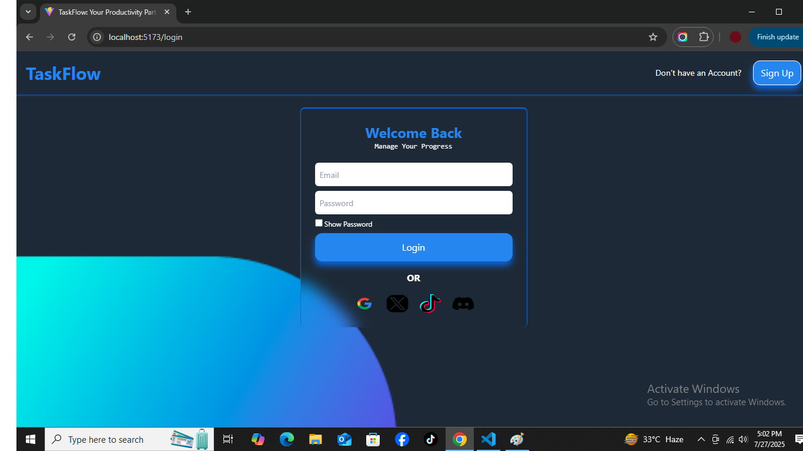
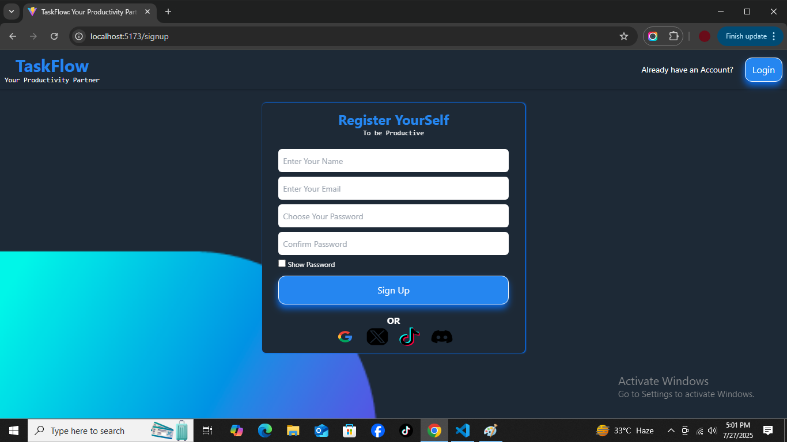
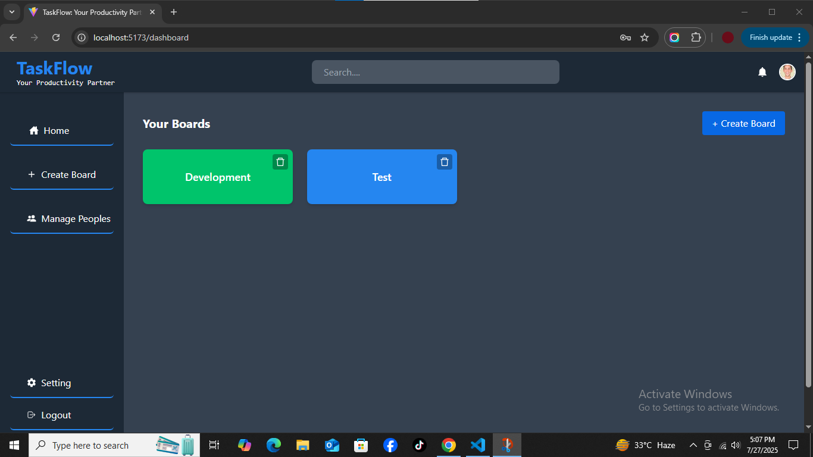
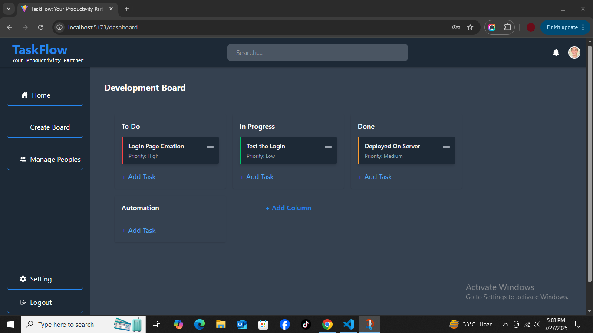
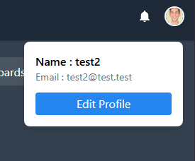

# TaskFlow App

A full-stack Kanban-style task management application built with **React, Node.js, Express, MongoDB, and TailwindCSS**.  
It allows users to manage projects, boards, tasks, columns, and team members with an intuitive drag-and-drop interface.

---

## ✨ Features

- **User Authentication** (JWT)
- **Create & Manage Boards**
- **Columns & Tasks Management**
  - Add, update, and delete tasks
  - Drag & drop tasks between columns (with DB update)
- **Team Management**
  - Invite members to boards
  - View team members & user details
- **Fully Responsive UI** (mobile, tablet, desktop)

---

## 🚀 Tech Stack

**Frontend:** React, TailwindCSS, @hello-pangea/dnd, React-Icons, React Toastify  
**Backend:** Node.js, Express, MongoDB, JWT Authentication  
**Other:** HeadlessUI for modals, Nodemon (dev)

---

## 📸 Screenshots

### Login



### SignUp



### Dashboard



### Board View (Tasks)



### Peoples


### Invite Members


### Profile



All Other Pictures are placed inside the docs/screenshots/ folder

---

## ⚙️ Installation & Setup

### 1. Clone Repository

```bash
git clone https://github.com/shoaibch05/TaskFlow.git
cd TaskFLow

2. Backend Setup

cd backend
npm install
cp .env.example .env   # Add MongoDB URI & JWT Secret
npm run dev

3. Frontend Setup

cd frontend
npm install
npm run dev

4. Open in Browser

Visit: http://localhost:5173


---

📂 Folder Structure

.
├── backend
│   ├── Models/
│   ├── Routes/
│   └── server.js
├── frontend
│   ├── src/components/
│   ├── src/api/
│   └── src/App.js
└── docs/
    └── screenshots/


---

📜 License

This project is licensed under the MIT License.


---

🤝 Contributing

Pull requests are welcome. For major changes, please open an issue first to discuss what you would like to change.
```
